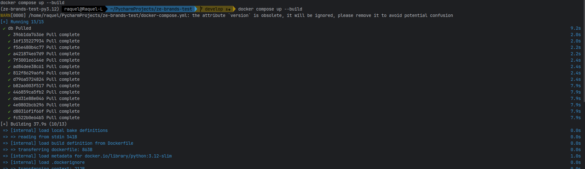
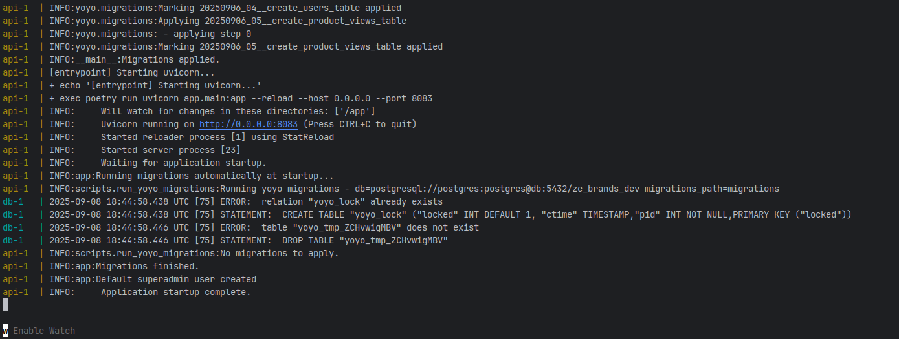
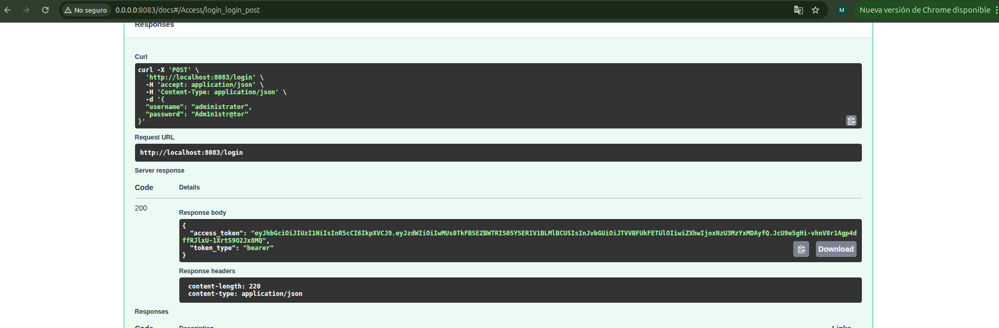

# README_DEPLOY_LOCAL —  Docker + Local deployment

Este repositorio incluye scripts y plantillas para realizar el despliegue de la API en un entorno loal.


## ⚙️ Pre-requisitos
- Docker instalado y funcionando.
- AWS CLI instalado y configurado (aws configure) con un perfil que tenga permisos necesarios.
- Tener en el repo:
  - `Dockerfile`
  - `docker-compose.yml`
  - `env/local.env` (variables para entorno local, actualice con sus AWS credentials)
  - `env/sandbox.env` (ejemplo de sandbox)
  - `scripts/entrypoint.sh` (espera DB, corre migraciones y arranca la app)
  - `scripts/wait_for_postgres.py` (espera a Postgres)
  - `scripts/run_yoyo_migrations.py` (ejecuta migraciones con yoyo)
  - `.dockerignore`
  - `Makefile` (comandos de utilidad)

## 🚀 Pasos para levantar localmente
1. Copia `env/local.env` a la raíz del repo como `.env` si quieres (opcional):
   ```bash
   cp env/local.env .env
   ```
2. Dar permisos a `scripts/entrypoint.sh` que se ejecuta dentro del contenedor:
   ```bash
   chmod +x scripts/entrypoint.sh
   ```
3. Construir y levantar con docker-compose:
   ```bash
   docker compose up --build
   ```
4. Ver logs:
   ```bash
   docker compose logs -f api
   ```
5. Comando para limpiar contendedores (en caso de ser necesario):
   ```bash
   docker compose down -v --rmi all --remove-orphans
   ```

La imagen de la API montará el código en `/app` y usará `uvicorn` con `--reload` para desarrollo. Las migraciones se ejecutan automáticamente si `AUTO_MIGRATE=true`.

## 🚀 Capturas del proceso realizado en mi local

Asi se desplegó en local
1. Se desplegaron correctamente los contenedores



2. La API levantó correctamente por http://0.0.0.0:8083



3. Test al login con el usuario creado por defecto
