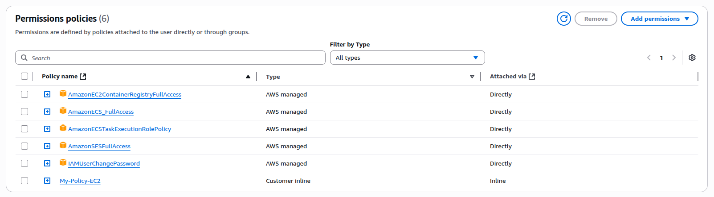

# README_DEPLOY_PROD — despliegue ECR → ECS (Fargate)

Este repositorio incluye scripts y plantillas para desplegar la API en AWS: se construye la imagen Docker, se sube a ECR y se despliega en ECS Fargate.
Además el flujo opcional crea/actualiza un secret en AWS Secrets Manager para almacenar la `DATABASE_URL`.

## ⚙️ Pre-requisitos
- Docker instalado y funcionando.
- AWS CLI instalado y configurado (aws configure) con un perfil que tenga permisos necesarios.
- Tener en el repo:
    - Dockerfile.prod
    - env/prod.env (actualice con sus AWS credentials)
    - scripts/entrypoint.prod.sh 
    - scripts/build_and_push.sh
    - scripts/deploy_ecs.sh
    - scripts/task-def.tpl.json

- El usuario/CLI que ejecuta los scripts necesita permisos ECR, ECS, IAM (al menos iam:PassRole), CloudWatch Logs y SecretsManager (si vas a crear secrets). Pide al admin las políticas mínimas o roles ya creados:
    - AmazonEC2ContainerRegistryFullAccess (o permisos ECR selectivos)
    - AmazonECS_FullAccess (o permisos ECS selectivos)
    - AmazonECSTaskExecutionRolePolicy en el role TASK_EXECUTION_ROLE_ARN
    

## 🚀 Pasos para desplegar

1. Edita `prod.env` con tus valores y carga:
   ```bash
   cd env/
   source prod.env
   ```
   
2. Dar permisos a `scripts/entrypoint.sh` y otros:
   ```bash
   cd ..
   chmod +x scripts/*.sh
   ```
   
3. Construye y sube la imagen a ECR:
   ```bash
   bash -x ./scripts/build_and_push.sh
   ```
   
   Puedes asegurarte que se subió con
   ```bash
   aws ecr describe-images \
      --repository-name ze-brands-api \
      --region us-east-1 \
      --image-ids imageTag=latest
   ```
    O directamente en la consola. Como podemos ver se ha subido la imagen correctamente
    

4. Configuraciones necesarias en AWS
    Crear cluster
     ```bash
      aws ecs create-cluster --cluster-name ze-brands-cluster --region us-east-1
     ```
   
    Crear el Security Group (guarda el id en SG_ID)
     ```bash
      SG_ID=$(aws ec2 create-security-group \
      --group-name ze-brands-sg \
      --description "SG para ze-brands-api Fargate (puerto 8080)" \
      --vpc-id vpc-08066f97b0b180106 \
      --region us-east-1 \
      --query 'GroupId' --output text)
     ```

    Permitir inbound TCP 8080 desde anywhere
    ```bash
    aws ec2 authorize-security-group-ingress \
      --group-id "$SG_ID" \
      --protocol tcp --port 8080 --cidr 0.0.0.0/0 \
      --region us-east-1
    ```

    Permitir todo egress
    ```bash
    aws ec2 authorize-security-group-egress \
      --group-id "$SG_ID" \
      --protocol -1 --cidr 0.0.0.0/0 \
      --region us-east-1 || true
    ```
   
    Guarda el id en SG_ID
    ```bash
      echo "Security Group creado: $SG_ID"
    ```
    Sustituye el ID en este comando para listar las SUBNETS
    ```bash
    aws ec2 describe-subnets \
      --region us-east-1 \
      --query "Subnets[*].[SubnetId,VpcId,AvailabilityZone,MapPublicIpOnLaunch]" \
      --output table
    ```
    Actualiza con el $SG_ID la variable `SECURITY_GROUP_ID` del `prod.env`
    
    Actualiza con las subnet listadas el `SUBNET_IDS`
    
    Ejemplo, en mi caso:
    ```
      SUBNET_IDS=subnet-07c54c8d72557ddaa,subnet-02ab8998d64ad5242,subnet-001308fc5e67847b7,subnet-0bee8afd5437c0ab0,subnet-09ad43b9f4c826688,subnet-0efc0d0eab77ddc25
      SECURITY_GROUP_ID=sg-0e193f8f67bd5128a
    ```
   

    Crear el rol **ecsTaskRole** 
    ```
    Ve a IAM → Roles → Create role.
    En Trusted entity type, elige: AWS service.
    En Use case, selecciona: Elastic Container Service → Elastic Container Service Task.
    Da clic en Next y si tu app no necesita permisos extra (ej. S3, Dynamo, SQS), puedes crearlo sin políticas adicionales.
    Ponle el nombre exacto: ecsTaskRole.
    En Trusted relationships
    {
     "Version": "2012-10-17",
     "Statement": [
         {
             "Effect": "Allow",
             "Principal": {
                 "Service": "ecs-tasks.amazonaws.com"
             },
             "Action": "sts:AssumeRole"
         }
     ]
    }
    ```

    Crear el rol **ecsTaskExecutionRole** 
    ```
    Ve a IAM → Roles → Create role.
    En Trusted entity type, selecciona:
    AWS service
    Elige Elastic Container Service → Elastic Container Service Task.
    En Attach permissions policies, marca:
    ✅ AmazonECSTaskExecutionRolePolicy
    Ponle el nombre exacto:
    ecsTaskExecutionRole
    Crea el rol.
    En Trusted relationships
    {
     "Version": "2012-10-17",
     "Statement": [
         {
             "Effect": "Allow",
             "Principal": {
                 "Service": "ecs-tasks.amazonaws.com"
             },
             "Action": "sts:AssumeRole"
         }
     ]
    }
    ```
    
    Recarga las ENV si es necesario para tomar los cambios
    ```bash
       source ./env/prod.env
    ```
   
6. Despliega en ECS:
   
    Registrar task + crear cluster + crear servicio (y crear/actualizar secret si diste DB_SECRET_NAME):
   ```bash
   bash -x ./scripts/deploy_ecs.sh
   ```
   
    

    Lo que resta sería poder configurar un RDS de aurora postgres serverless por ejemplo para configurarle una DB
    
    Cree la DB usando RDS postgres
    
    
    Le configure al ECS la variable de entorno con `DATABASE_URL`
    
    
    Servicio corriendo
    